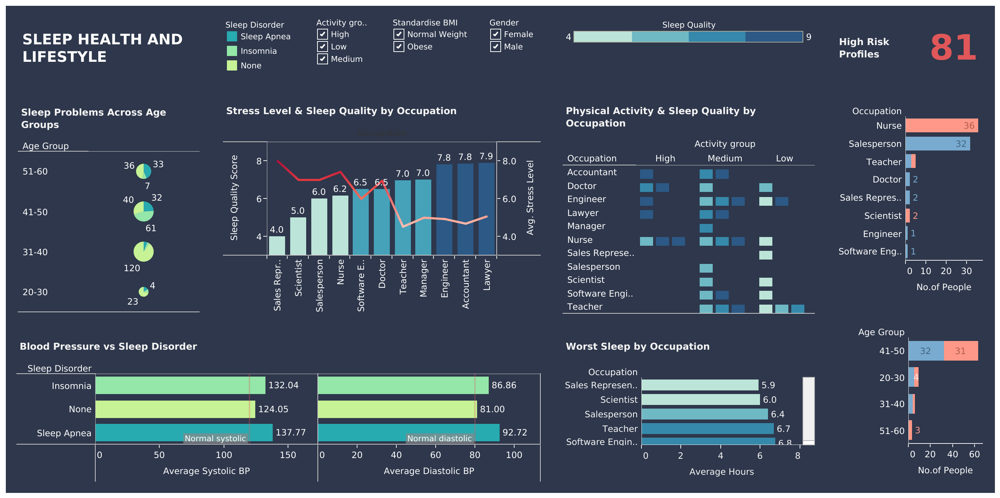

# Sleep Health & Lifestyle Analysis

**Date:** October 2025

## Overview
I analyzed sleep health data to identify high-risk individuals and occupations with poor sleep quality, examining how lifestyle factors and demographics affect sleep patterns.

**Tools:** PostgreSQL, Tableau  
**Dataset:** [Kaggle Sleep Health and Lifestyle Dataset](https://www.kaggle.com/datasets/uom190346a/sleep-health-and-lifestyle-dataset)

## Key Questions
1. Which occupations have the worst sleep quality and duration?
2. What factors (daily steps, stress, BMI) correlate with poor sleep?
3. Which age groups are most at risk for sleep disorders?
4. How does physical activity level impact sleep quality across different occupations?
5. What is the profile of high-risk individuals?

---

## Data Cleaning

Before analysis, I cleaned the data to standardize formats and create useful groupings. First, I created a backup table. Then, I split the blood pressure column into systolic and diastolic BP. I categorized ages into four groups (20-30, 31-40, 41-50, 51-60) for easier comparison. The dataset had inconsistent naming (e.g., "Normal Weight" vs "Normal," "Overweight" vs "Obese"). I merged Overweight and Obese into one "Obese" category to simplify analysis.


---

## 1. Which occupations have the worst sleep?

To identify which occupations struggle most with sleep, I calculated average sleep duration by occupation.

**SQL Query:**
```sql
select occupation, 
       round(avg(sleep_duration), 1) as sleep_duration
from sleep_health
group by occupation
order by sleep_duration asc;
```

I grouped by occupation and used `avg()` to calculate average sleep hours, then sorted in ascending order to show the lowest sleep duration first.

**Results:**

| occupation           | sleep_duration |
|----------------------|----------------|
| sales representative | 5.9            |
| scientist            | 6.0            |
| salesperson          | 6.4            |
| teacher              | 6.7            |
| software engineer    | 6.8            |
| manager              | 6.9            |
| doctor               | 7.0            |
| accountant           | 7.1            |
| nurse                | 7.1            |
| lawyer               | 7.4            |
| engineer             | 8.0            |

Sales representatives and scientists get the least sleep at around 6 hours, well below the recommended 7-8 hours. Engineers sleep best at 8 hours on average.

---

## 2. What factors correlate with poor sleep?

I examined three key factors: BMI, daily steps, and stress level.

### BMI Impact

```sql
select bmi_category,
       count(*) as no_of_people,
       round(avg(quality_of_sleep), 2) as avg_sleep_quality,
       round(avg(sleep_duration), 2) as avg_sleep_hours
from sleep_health
group by bmi_category
order by avg_sleep_quality desc;
```

I calculated average sleep quality and duration for each BMI category, sorted by sleep quality.

**Results:**

| bmi_category | no_of_people | avg_sleep_quality | avg_sleep_hours |
|--------------|--------------|-------------------|-----------------|
| normal       | 216          | 7.64              | 7.39            |
| obese        | 158          | 6.87              | 6.78            |

People with normal BMI have significantly better sleep quality (7.64 vs 6.87) and sleep nearly an hour more per night than obese individuals.

### Daily Steps Impact

```sql
select case 
           when daily_steps < 5000 then 'low (<5000)'
           when daily_steps between 5000 and 8000 then 'medium (5000-8000)'
           else 'high (>8000)'
       end as steps_category,
       count(*) as no_of_people,
       round(avg(quality_of_sleep), 2) as avg_sleep_quality
from sleep_health
group by steps_category
order by avg_sleep_quality desc;
```

I created step categories using `case when` to group people into low, medium, and high activity levels.

**Results:**

| steps_category     | no_of_people | avg_sleep_quality |
|--------------------|--------------|-------------------|
| medium (5000-8000) | 319          | 7.53              |
| high (>8000)       | 36           | 6.17              |
| low (<5000)        | 19           | 5.84              |

Interestingly, medium activity (5000-8000 steps) produces the best sleep quality at 7.53. Very high activity (>8000 steps) actually correlates with worse sleep (6.17), possibly indicating overtraining or high-stress lifestyles. Moderate activity should be encouraged.

### Stress Level Impact

```sql
select stress_level,
       count(*) as no_of_people,
       round(avg(quality_of_sleep), 2) as avg_sleep_quality
from sleep_health
group by stress_level
order by stress_level;
```

**Results:**

| stress_level | no_of_people | avg_sleep_quality |
|--------------|--------------|-------------------|
| 3            | 71           | 8.97              |
| 4            | 70           | 7.67              |
| 5            | 67           | 7.90              |
| 6            | 46           | 7.00              |
| 7            | 50           | 6.00              |
| 8            | 70           | 5.86              |

Lowest stress (level 3) has very good sleep quality at 8.97, while highest stress (level 8) drops to poor quality at 5.86. Stress level 7 or higher indicates a need for attention.

---

## 3. Which age groups are most at risk for sleep disorders?

I analyzed sleep quality and disorder prevalence across age groups.

### Sleep Quality by Age

```sql
select age_group, 
       round(avg(quality_of_sleep), 1) as sleep_quality
from sleep_health
group by age_group
order by sleep_quality desc;
```

**Results:**

| age_group | sleep_quality |
|-----------|---------------|
| 51-60     | 8.7           |
| 31-40     | 7.3           |
| 41-50     | 6.8           |
| 20-30     | 6.2           |

Older adults (51-60) have the best sleep quality at 8.7, while young adults (20-30) struggle most at 6.2, likely due to lifestyle and work stress.

### Sleep Disorders by Age

```sql
select age_group, 
       sleep_disorder,
       count(*) as no_of_people
from sleep_health
group by age_group, sleep_disorder
order by age_group, sleep_disorder;
```

**Results:**

| age_group | sleep_disorder | no_of_people |
|-----------|----------------|--------------|
| 20-30     | insomnia       | 4            |
| 20-30     | none           | 23           |
| 20-30     | sleep apnea    | 5            |
| 31-40     | insomnia       | 5            |
| 31-40     | none           | 120          |
| 31-40     | sleep apnea    | 8            |
| 41-50     | insomnia       | 61           |
| 41-50     | none           | 40           |
| 41-50     | sleep apnea    | 32           |
| 51-60     | insomnia       | 7            |
| 51-60     | none           | 36           |
| 51-60     | sleep apnea    | 33           |

Age group 41-50 has the highest disorder rate with 61 insomnia cases and 32 sleep apnea cases. The 51-60 group has 33 sleep apnea cases despite good sleep quality.

---

## 4. How does physical activity impact sleep Quality across occupations?

I examined how different activity levels affect sleep quality for each occupation.

**SQL Query:**
```sql
select occupation, 
       case 
           when physical_activity_level between 0 and 30 then 'low'
           when physical_activity_level between 31 and 60 then 'medium'
           when physical_activity_level > 60 then 'high'
       end as activity_group,
       round(avg(sleep_duration), 1) as avg_sleep_duration,
       round(avg(quality_of_sleep), 1) as avg_sleep_quality
from sleep_health
group by occupation, activity_group
order by occupation, activity_group;
```

I created activity level categories and calculated average sleep metrics for each occupation-activity combination.

**Results:**

| occupation           | activity_group | avg_sleep_duration | avg_sleep_quality |
|----------------------|----------------|--------------------|--------------------|
| accountant           | high           | 8.0                | 9.0                |
| accountant           | medium         | 7.1                | 7.8                |
| doctor               | high           | 7.8                | 7.2                |
| doctor               | low            | 6.1                | 6.0                |
| doctor               | medium         | 6.2                | 6.0                |
| engineer             | high           | 7.7                | 8.0                |
| engineer             | low            | 8.4                | 9.0                |
| engineer             | medium         | 7.2                | 7.5                |
| lawyer               | high           | 7.7                | 8.0                |
| lawyer               | medium         | 7.2                | 7.8                |
| manager              | medium         | 6.9                | 7.0                |
| nurse                | high           | 7.1                | 7.5                |
| nurse                | medium         | 6.6                | 5.9                |
| sales representative | low            | 5.9                | 4.0                |
| salesperson          | medium         | 6.4                | 6.0                |
| scientist            | medium         | 6.0                | 5.0                |
| software engineer    | low            | 5.9                | 4.0                |
| software engineer    | medium         | 7.0                | 7.3                |
| teacher              | low            | 6.8                | 7.0                |
| teacher              | medium         | 6.7                | 7.0                |

Higher physical activity generally improves sleep quality across most occupations. Accountants, with high activity, have excellent sleep (9.0 quality), while sales representatives and software engineers with low activity have poor sleep (4.0 quality).

---

## 5. What is the profile of high-risk individuals?

I identified individuals based on multiple risk factors: sleep quality ≤6, stress level ≥7, and either having a sleep disorder or being obese.

### High-Risk Count

```sql
select count(*) as high_risk_count
from sleep_health
where quality_of_sleep <= 6 
    and stress_level >= 7
    and (sleep_disorder != 'None' or bmi_category = 'Obese');
```

**Result:** 81 high-risk individuals (21.7% of total population)

### High-Risk by Occupation

```sql
select occupation,
       count(*) as high_risk_count
from sleep_health
where quality_of_sleep <= 6 
    and stress_level >= 7
    and (sleep_disorder != 'None' or bmi_category = 'Obese')
group by occupation
order by high_risk_count desc;
```

**Results:**

| occupation           | high_risk_count |
|----------------------|-----------------|
| nurse                | 36              |
| salesperson          | 32              |
| teacher              | 5               |
| scientist            | 2               |
| doctor               | 2               |
| sales representative | 2               |
| engineer             | 1               |
| software engineer    | 1               |

Nurses (36) and salespeople (32) make up 84% of all high-risk cases and need attention.

### High-Risk Profile Summary

```sql
select count(*) as high_risk_count,
       round(avg(quality_of_sleep), 2) as avg_quality,
       round(avg(sleep_duration), 2) as avg_sleep_hours,
       round(avg(stress_level), 2) as avg_stress
from sleep_health
where quality_of_sleep <= 6 
    and stress_level >= 7
    and (sleep_disorder != 'None' or bmi_category = 'Obese');
```

**Results:**

| high_risk_count | avg_quality | avg_sleep_hours | avg_stress |
|-----------------|-------------|-----------------|------------|
| 81              | 5.63        | 6.25            | 7.52       |


High-risk individuals average only 6.25 hours of sleep with poor quality (5.63) and high stress (7.52).


---

## Tableau Dashboard



[View Interactive Dashboard on Tableau Public](https://public.tableau.com/views/SleepHealthAnalysisDashboard/Dashboard1?:language=en-US&:sid=&:redirect=auth&:display_count=n&:origin=viz_share_link)

---

## Files

- `queries.sql` — All SQL queries used in this analysis
- `sleep-analysis-dashboard.png` — Tableau dashboard visualization
